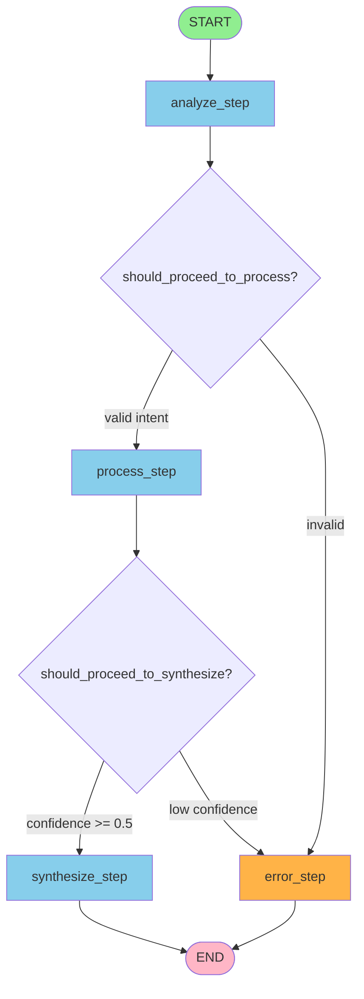

# Architecture Overview

This document describes the technical architecture of the Prompt-Chaining Workflow Template.

## Visual Architecture

The prompt-chaining pattern uses **LangGraph StateGraph** to orchestrate three sequential steps that process user requests through distinct phases. Each step operates independently with its own Claude model, configuration, and validation gates between steps. Structured state management via Pydantic models ensures reliable data flow and enables comprehensive observability. Validation gates enforce quality boundaries between steps, preventing low-quality outputs from corrupting downstream processing.

### LangGraph State Machine

The workflow is orchestrated as a directed graph with nodes representing processing steps and conditional edges representing validation gates:



This state machine diagram shows the complete execution flow: requests enter at START, flow sequentially through analyze, process, and synthesize steps, with validation gates routing invalid outputs to the error handler. Both success and error paths terminate at END, where responses are streamed to the client.

### Chain Flow with Validation Gates

The chain flow diagram shows how data moves through the workflow with validation gates enforcing quality boundaries:

```mermaid
graph LR
    input["User Message Input"] --> analyze["Analyze Step<br/>Extract Intent & Entities"]
    analyze --> analysis["Analysis Output<br/>intent, entities, complexity"]
    analysis --> gate1["Validation Gate 1<br/>intent non-empty?"]
    gate1 -->|PASS| process["Process Step<br/>Generate Content"]
    gate1 -->|FAIL| error["Error Handler<br/>Return Error"]
    process --> process_out["Process Output<br/>content, confidence"]
    process_out --> gate2["Validation Gate 2<br/>confidence >= 0.5?"]
    gate2 -->|PASS| synthesize["Synthesize Step<br/>Polish & Format"]
    gate2 -->|FAIL| error
    synthesize --> final["Final Response<br/>Streamed to Client"]
    error --> final

    style input fill:#E8F4F8
    style analysis fill:#D4E8F0
    style process_out fill:#D4E8F0
    style final fill:#C0D9E8
    style gate1 fill:#FFE4B5
    style gate2 fill:#FFE4B5
    style error fill:#FFB347
    style analyze fill:#87CEEB
    style process fill:#87CEEB
    style synthesize fill:#87CEEB
```



Validation gates control workflow progression: Gate 1 (after analyze) checks that intent is present and non-empty, preventing vague requests from corrupting the processing step. Gate 2 (after process) checks both that content is non-empty and confidence >= 0.5, ensuring only high-quality generated content reaches the synthesis step. Both gates can route to the error handler, enabling fail-fast behavior on quality issues.

### ChainState Evolution Through Steps

The state evolves as each step completes, accumulating outputs and metadata:

```
INITIAL STATE (at START):
├─ messages: [HumanMessage("What's the capital of France?")]
├─ analysis: None
├─ processed_content: None
├─ final_response: None
└─ step_metadata: {}

AFTER ANALYZE STEP:
├─ messages: [HumanMessage(...), AIMessage(analysis_json)]
├─ analysis: {
│   ├─ intent: "Find the capital of France"
│   ├─ key_entities: ["France", "capital"]
│   ├─ complexity: "simple"
│   └─ context: {}
│   }
├─ processed_content: None
├─ final_response: None
└─ step_metadata: {
    └─ analyze: {tokens: 241, cost: $0.00096, elapsed: 1.23s}
    }

AFTER PROCESS STEP:
├─ messages: [HumanMessage(...), AIMessage(analysis), AIMessage(process_json)]
├─ analysis: {...}  (unchanged)
├─ processed_content: {
│   ├─ content: "The capital of France is Paris..."
│   ├─ confidence: 0.95
│   └─ metadata: {source: "geographic_knowledge"}
│   }
├─ final_response: None
└─ step_metadata: {
    ├─ analyze: {...}
    └─ process: {tokens: 699, cost: $0.00356, confidence: 0.95, elapsed: 2.45s}
    }

AFTER SYNTHESIZE STEP (FINAL):
├─ messages: [HumanMessage(...), AIMessage(...), AIMessage(...), AIMessage(synthesize_json)]
├─ analysis: {...}
├─ processed_content: {...}
├─ final_response: "# Capitals of France\n\nThe capital of France..."
└─ step_metadata: {
    ├─ analyze: {...}
    ├─ process: {...}
    └─ synthesize: {tokens: 888, cost: $0.00289, formatting: markdown, elapsed: 1.89s}
    }

TOTAL AGGREGATION:
├─ Total Tokens: 1,828
├─ Total Cost: $0.00741
└─ Total Time: 5.57 seconds
```

The state demonstrates message accumulation via the `add_messages` reducer (enabling future multi-turn conversations), progressive population of step output fields, and metadata tracking across all processing phases. Each step's metrics (tokens, cost, elapsed time) accumulate in `step_metadata` for complete workflow visibility.

## Core Design Pattern: Prompt-Chaining

The system implements a production-grade prompt-chaining pattern for sequential multi-step AI workflows using LangGraph's StateGraph.

### Overview

The prompt-chaining pattern orchestrates sequential processing through three distinct steps, each optimized for its specific role:

1. **Analysis Step**: Parse user intent, identify key entities, assess complexity
2. **Processing Step**: Generate content based on analysis results
3. **Synthesis Step**: Combine and polish results into final response

Each step operates independently with its own Claude model, configuration, and validation gates between steps. State flows through the workflow via `ChainState`, a LangGraph TypedDict that accumulates messages and step outputs.

### Components

#### 1. Analysis Agent
- **Model**: Configurable (default: Claude Haiku 4.5)
- **Purpose**: Intent parsing and understanding
- **Responsibilities**:
  - Parse and understand user intent
  - Extract key entities and concepts
  - Assess task complexity
  - Provide context for processing
  - Return `AnalysisOutput` with intent, entities, complexity

#### 2. Processing Agent
- **Model**: Configurable (default: Claude Haiku 4.5)
- **Purpose**: Content generation
- **Responsibilities**:
  - Generate content based on analysis results
  - Operate on extracted intent and context
  - Return structured `ProcessOutput` with content and confidence
  - Provide metadata for traceability

#### 3. Synthesis Agent
- **Model**: Configurable (default: Claude Haiku 4.5)
- **Purpose**: Response polishing and formatting
- **Responsibilities**:
  - Combine processed content into final response
  - Apply formatting and styling
  - Return `SynthesisOutput` with polished text
  - Stream final response to client

### Coordination Flow

```
User Request
    ↓
[Security Headers Middleware]
    ↓
[Request Size Validation]
    ↓
[JWT Authentication]
    ↓
LangGraph StateGraph Initialization
    ↓
Analysis Step: Parse Intent & Extract Context
    ↓
[Validation Gate]
    ↓
Processing Step: Generate Content
    ↓
[Validation Gate]
    ↓
Synthesis Step: Polish & Format
    ↓
[Validation Gate]
    ↓
Stream Response (SSE format)
    ↓
[Apply Security Headers]
    ↓
Client
```

### Key Characteristics

1. **Sequential Execution**: Steps execute in order with state flowing through `ChainState`
2. **Message Accumulation**: `add_messages` reducer maintains conversation continuity
3. **Validation Gates**: Optional validation between steps with configurable strictness
4. **Independent Configuration**: Each step has its own model, tokens, temperature, and prompt
5. **Structured Outputs**: Type-safe step results (AnalysisOutput, ProcessOutput, SynthesisOutput)
6. **State Management**: Central `ChainState` TypedDict tracks messages and step outputs
7. **Defense-in-Depth Security**: Multiple layers of validation and protection

## Prompt-Chaining Pattern Details

### State Management with ChainState

The `ChainState` TypedDict (from `src/workflow/models/chains.py`) maintains state across all processing steps:

```python
class ChainState(TypedDict):
    messages: Annotated[list[BaseMessage], add_messages]
    # Accumulated messages through chain - uses add_messages reducer for proper merging

    request_id: str
    # Trace ID for cross-step correlation and external API calls

    user_id: str
    # User identifier from JWT sub claim for multi-tenant tracking

    analysis: dict[str, Any] | None
    # Output from analysis step containing intent, entities, complexity

    processed_content: str | None
    # Output from processing step containing generated content

    final_response: str | None
    # Final synthesized output from synthesis step

    step_metadata: dict[str, Any]
    # Tracking metadata for the entire chain execution (timing, costs, etc.)
```

**Key Features**:
- **Message Accumulation**: `add_messages` reducer merges new messages with existing ones, maintaining conversation continuity
- **Request Tracing**: `request_id` enables cross-step correlation and propagates to Anthropic API calls
- **User Tracking**: `user_id` from JWT authentication enables multi-tenant filtering and user-specific debugging
- **Step Outputs**: Each step populates its own field (analysis, processed_content, final_response)
- **Metadata Tracking**: Captures timing, costs, and other observability metrics across all steps

### Step Output Models

Each step returns a type-safe structured model:

**AnalysisOutput**:
```python
class AnalysisOutput(BaseModel):
    intent: str  # User's primary intent
    key_entities: list[str]  # Key concepts mentioned
    complexity: str  # "simple", "moderate", or "complex"
    context: dict[str, Any]  # Additional contextual information
```

**ProcessOutput**:
```python
class ProcessOutput(BaseModel):
    content: str  # Generated content
    confidence: float  # 0.0 to 1.0 confidence score
    metadata: dict[str, Any]  # Generation metadata
```

**SynthesisOutput**:
```python
class SynthesisOutput(BaseModel):
    final_text: str  # Polished and formatted response
    formatting: str  # Applied formatting style
```

### Configuration with ChainConfig

Complete workflow configuration (from `src/workflow/models/chains.py`):

```python
class ChainStepConfig(BaseModel):
    model: str  # Claude model ID
    max_tokens: int  # Maximum tokens to generate
    temperature: float  # 0.0-2.0 sampling temperature
    system_prompt_file: str  # System prompt filename

class ChainConfig(BaseModel):
    analyze: ChainStepConfig  # Analysis step config
    process: ChainStepConfig  # Processing step config
    synthesize: ChainStepConfig  # Synthesis step config
    analyze_timeout: int = 15  # Analysis timeout (1-270 seconds)
    process_timeout: int = 30  # Processing timeout (1-270 seconds)
    synthesize_timeout: int = 20  # Synthesis timeout (1-270 seconds)
    enable_validation: bool = True  # Enable validation gates
    strict_validation: bool = False  # Fail vs. warn on validation errors
```

## System Prompts

The prompt-chaining workflow uses three specialized system prompts that control the behavior of each processing step:

### chain_analyze.md - Analysis Step Prompt

**Purpose**: Analyze user requests and extract structured information for subsequent steps

**Location**: `src/workflow/prompts/chain_analyze.md`

**Responsibilities**:
- Parse user intent from natural language requests
- Extract key entities, concepts, and topics mentioned
- Assess task complexity (simple, moderate, complex)
- Gather contextual information for processing step

**Output**: AnalysisOutput JSON with:
- `intent`: Clear statement of user's primary goal
- `key_entities`: List of important topics/concepts/entities
- `complexity`: Complexity level assessment
- `context`: Dictionary with additional contextual information

**Example Output**:
```json
{
  "intent": "Compare synchronous vs asynchronous Python code for high-concurrency APIs",
  "key_entities": ["synchronous code", "asynchronous code", "performance", "concurrency"],
  "complexity": "moderate",
  "context": {
    "domain": "backend development",
    "scale": "1000 requests per second"
  }
}
```

### chain_process.md - Processing Step Prompt

**Purpose**: Generate substantive content based on analysis output

**Location**: `src/workflow/prompts/chain_process.md`

**Responsibilities**:
- Receive AnalysisOutput from analysis step
- Generate domain-specific content addressing identified intent
- Assess confidence in generated content
- Capture metadata for traceability

**Input**: AnalysisOutput from analysis step

**Output**: ProcessOutput JSON with:
- `content`: Generated content addressing the intent
- `confidence`: Confidence score (0.0 to 1.0)
- `metadata`: Dictionary with generation metadata

**Example Output**:
```json
{
  "content": "Synchronous Python code blocks each request until complete, while asynchronous code uses await...",
  "confidence": 0.85,
  "metadata": {
    "generation_approach": "comparative analysis",
    "coverage": "both approaches with examples"
  }
}
```

### chain_synthesize.md - Synthesis Step Prompt

**Purpose**: Polish and format the final response for user consumption

**Location**: `src/workflow/prompts/chain_synthesize.md`

**Responsibilities**:
- Receive ProcessOutput from processing step
- Apply formatting and styling to content
- Optimize response for clarity and presentation
- Ensure output meets quality standards

**Input**: ProcessOutput from processing step

**Output**: Clean formatted text (markdown, plain text, or structured format)
- Streamed directly to client without JSON wrapping
- Internal SynthesisOutput model wraps text for state tracking:
  - `final_text`: Polished and formatted response
  - `formatting`: Detected formatting style (markdown, plain, structured)

**Example Output** (streamed to client):
```markdown
# Synchronous vs Asynchronous Python

Synchronous code blocks execute one statement at a time...
```

**Internal State** (SynthesisOutput model):
```json
{
  "final_text": "# Synchronous vs Asynchronous Python\n\nSynchronous code blocks...",
  "formatting": "markdown"
}
```

### Data Flow Through Prompts

The three prompts work together in sequence:

```
User Request
    ↓
chain_analyze.md (Parse & Extract)
    ↓
AnalysisOutput (JSON)
    ↓
chain_process.md (Generate)
    ↓
ProcessOutput (JSON)
    ↓
chain_synthesize.md (Polish & Format)
    ↓
SynthesisOutput (JSON)
    ↓
User Response
```

Each step's system prompt defines:
- The agent's specific role and responsibilities
- What information to extract or generate
- How to structure output as valid JSON
- Quality expectations and guidelines

### JSON-Only Output Format

All three prompts enforce JSON-only output:
- No markdown code blocks or extra text
- Valid JSON matching the corresponding Pydantic model
- Enables strict parsing and validation in step functions
- Ensures reliable data flow between steps

This strict format is critical for prompt-chaining workflows where structured outputs feed directly into subsequent steps.

### Structured Outputs Architecture

The analyze and process steps use LangChain's native `with_structured_output()` API for schema-enforced JSON validation. This is a architectural decision that improves reliability and eliminates manual JSON parsing.

**Step-by-Step Breakdown**:

1. **Analyze Step**: Uses structured output
   - Input: User message
   - Output Model: `AnalysisOutput` (Pydantic)
   - Schema Enforcement: API validates response matches schema
   - Token Overhead: None for Sonnet/Opus; ~1% for Haiku (tool calling)

2. **Process Step**: Uses structured output
   - Input: Analysis output
   - Output Model: `ProcessOutput` (Pydantic)
   - Schema Enforcement: API validates response matches schema
   - Validation Gate: Checks confidence >= 0.5 after parsing

3. **Synthesize Step**: No structured output
   - Input: Processed content
   - Output: Formatted text (no JSON)
   - Why: Synthesis returns free-form formatted text, not structured data
   - Optimal for streaming directly to user

**LangChain Strategy Selection** (Automatic):

```
Model: Sonnet 4.5 or Opus 4.1
  ↓
ProviderStrategy (Native API Support)
  → Uses Anthropic's json_schema method directly
  → No token overhead
  → Maximum performance

Model: Haiku 4.5
  ↓
ToolStrategy (Tool Calling)
  → Enforces schema via tool calling
  → ~1% additional tokens (~10 tokens per 1000)
  → Transparent to application
```

**Implementation in Steps**:

```python
# Step function (analyze or process)
llm = ChatAnthropic(
    model=config.analyze.model,      # Haiku, Sonnet, or Opus
    max_tokens=config.analyze.max_tokens,
    temperature=config.analyze.temperature,
)

# Enable structured output with raw message access
structured_llm = llm.with_structured_output(
    AnalysisOutput,           # Pydantic model
    method="json_schema",     # Anthropic method
    include_raw=True          # Essential for token tracking
)

# Invoke and extract results
result = await structured_llm.ainvoke(messages)
parsed_output = result.get("parsed")      # Validated model instance
raw_message = result.get("raw")           # Raw API response

# Extract tokens for cost tracking
input_tokens = raw_message.usage_metadata.get("input_tokens", 0)
output_tokens = raw_message.usage_metadata.get("output_tokens", 0)
```

**Benefits**:

1. **API-Level Validation**: Schema enforced by Claude API, not application code
2. **No Manual Parsing**: LangChain deserializes JSON automatically
3. **Better Error Messages**: Schema violations caught with clear error text
4. **Type Safety**: Parsed result is Pydantic instance (IDE autocomplete)
5. **Token Tracking Works**: `include_raw=True` provides usage_metadata
6. **Consistent Behavior**: Works identically across all Claude models

**Token Overhead Impact**:

| Model | Strategy | Overhead | Example |
|-------|----------|----------|---------|
| Haiku 4.5 | ToolStrategy | ~1% | 1000 tokens → ~1010 tokens |
| Sonnet 4.5 | ProviderStrategy | 0% | 1000 tokens → 1000 tokens |
| Opus 4.1 | ProviderStrategy | 0% | 1000 tokens → 1000 tokens |

The minimal overhead is acceptable for the reliability gains from API-level schema validation.

### Validation Gates

Quality enforcement between chain steps via schema and business logic validation.

**Purpose**: Validation gates ensure outputs conform to schemas and business rules before proceeding. Invalid outputs route to error handler.

**Gate Definitions**:
- **After Analyze**: `AnalysisOutput` schema + intent must be non-empty
- **After Process**: `ProcessOutput` schema + content non-empty + confidence >= 0.5

**Implementation** (`src/workflow/chains/validation.py`):
- Base class `ValidationGate` with schema validation via Pydantic
- Subclasses `AnalysisValidationGate`, `ProcessValidationGate` override for business rules
- Returns `(is_valid: bool, error_message: str | None)`

**LangGraph Integration**:
- `should_proceed_to_process(state)` → routes "process" (valid) or "error" (invalid)
- `should_proceed_to_synthesize(state)` → routes "synthesize" (valid) or "error" (invalid)
- Conditional edges prevent bad data from cascading downstream

**Configuration**:
- `enable_validation: bool = True` - Enable/disable all gates
- `strict_validation: bool = False` - Fail fast vs. warn and continue (lenient mode)

**Error Handling**: Invalid outputs logged at WARNING level with field names, reasons, constraints. State continues to error handler for graceful recovery.

**Real-World Impact**: Prevents incomplete/low-confidence outputs from corrupting downstream steps. Enforces quality boundaries while supporting both strict and lenient modes.

### Validation Gates: Success and Failure Paths

**Success Path**: "What is the capital of France?" →
```
analyze: intent="Find capital of France" → ✓ PROCEED
process: content="Paris is..." confidence=0.95 → ✓ PROCEED
synthesize: stream formatted response
```

**Failure Path 1** (Empty Intent):
```
analyze: intent="" (whitespace only) → ✗ ROUTE TO ERROR
error_step returns: {"error": "intent field is required..."}
```

**Failure Path 2** (Low Confidence):
```
process: confidence=0.3 < 0.5 → ✗ ROUTE TO ERROR
error_step returns: {"error": "confidence score below minimum threshold"}
```

**Error Routing Logic**:
```
analyze → should_proceed_to_process →
  ✓ process (intent non-empty)
  ✗ error (intent empty)

process → should_proceed_to_synthesize →
  ✓ synthesize (content non-empty AND confidence >= 0.5)
  ✗ error (validation fails)

Both error and success paths → END node → stream to client
```

### LangGraph Integration

The workflow uses `StateGraph` (from `src/workflow/chains/graph.py`) to orchestrate the sequential steps:

**Graph Architecture** (`build_chain_graph(config: ChainConfig)`):
- **Nodes**: `analyze`, `process`, `synthesize`, `error` - each step is an independent graph node
- **Edges**: START → analyze → (validation gate) → process → (validation gate) → synthesize → END (or error → END)
- **Conditional Edges**: Validation gates route to error handler on validation failures
- **State Management**: ChainState TypedDict with `add_messages` reducer maintains message accumulation
- **Async Execution**: Supports both non-streaming (`invoke_chain`) and streaming (`stream_chain`) modes

**Node Definitions**:

1. **START Node**
   - Entry point for all requests
   - Initializes ChainState with:
     - `messages`: List with initial HumanMessage from request
     - `analysis`: None (will be populated by analyze_step)
     - `processed_content`: None (will be populated by process_step)
     - `final_response`: None (will be populated by synthesize_step)
     - `step_metadata`: {} (accumulates metrics)

2. **analyze Node** (`analyze_step`)
   - Receives ChainState with user message
   - Outputs: ChainState with `analysis` field populated
   - Timeout: configurable (default 15s via `ChainConfig.analyze_timeout`)
   - State mutation: Updates `messages`, adds `analysis` dict, populates `step_metadata.analyze`

3. **process Node** (`process_step`)
   - Receives ChainState with `analysis` populated
   - Uses analysis output as context for generation
   - Outputs: ChainState with `processed_content` field populated
   - Timeout: configurable (default 30s via `ChainConfig.process_timeout`)
   - State mutation: Updates `messages`, adds `processed_content` string, populates `step_metadata.process`

4. **synthesize Node** (`synthesize_step`)
   - Receives ChainState with `processed_content` populated
   - Streams token-by-token (only streaming node)
   - Outputs: AsyncIterator yielding ChainState updates per chunk
   - Timeout: configurable (default 20s via `ChainConfig.synthesize_timeout`)
   - State mutation: Updates `messages` incrementally, accumulates `final_response`, populates `step_metadata.synthesize`

5. **error Node** (`error_step`)
   - Receives ChainState from failed validation gate
   - Returns user-friendly error message
   - Timeout: None (synchronous)
   - State mutation: Sets `final_response` to error message

**Conditional Edges**:

Edge 1: `analyze → should_proceed_to_process`
```python
# Logic in should_proceed_to_process(state):
if state.get("analysis") and state["analysis"].get("intent", "").strip():
    return "process"  # Valid: proceed
else:
    return "error"    # Invalid: route to error handler
```
- Success: ChainState flows to process node
- Failure: ChainState flows to error node with validation failure logged

Edge 2: `process → should_proceed_to_synthesize`
```python
# Logic in should_proceed_to_synthesize(state):
if state.get("processed_content"):
    content_dict = state["processed_content"]
    if isinstance(content_dict, dict):
        confidence = content_dict.get("confidence", 0)
        if confidence >= 0.5:
            return "synthesize"  # Valid: proceed
return "error"  # Invalid: route to error handler
```
- Success: ChainState flows to synthesize node
- Failure: ChainState flows to error node with validation failure logged

**Execution Modes**:
1. **invoke_chain()**: Non-streaming execution via `graph.ainvoke()`
   - Useful for testing and batch processing
   - Returns complete final ChainState after all steps execute
   - All steps run to completion before returning

2. **stream_chain()**: Streaming execution via `graph.astream()`
   - AsyncIterator yields state updates as they arrive
   - Earlier steps (analyze, process) run to completion
   - Synthesis step yields token-by-token via `astream()` on the LLM
   - Enables real-time streaming to client via SSE
   - `stream_mode="messages"` enables message-level granularity

**Error Handling**:
- Validation gates route invalid outputs to `error_step`
- Error step creates structured error response:
  ```python
  {
      "error": "Human-readable error message",
      "step": "analysis|processing|synthesis",
      "details": {
          "field": "field_name",
          "issue": "validation_issue",
          "value": actual_value,
          "expected": expected_constraint
      }
  }
  ```
- Both success and error paths terminate at END node
- Client receives error via SSE with [DONE] marker

## Performance Model

### Time Complexity
- **Prompt-Chaining**: O(N) where N = number of sequential steps
- **Total Time**: Sum of all step execution times + network latency
- **Typical**: 3-8 seconds for analysis + processing + synthesis

### Cost Complexity
- **Same as sequential processing**: O(N) - tokens used equals sum of all steps
- **Optimization**: Each step can use appropriate model size (Haiku for most, Sonnet if needed)

### Real-World Measurements
```
Analysis step:    ~1-2s (intent parsing, entity extraction)
Processing step:  ~2-4s (content generation)
Synthesis step:   ~1-2s (formatting and polishing)
Total request:    ~4-8s (plus network overhead)
```

## Technology Stack

**Framework**: FastAPI (async web), Uvicorn (ASGI), Pydantic v2 (validation)

**AI Integration**: Anthropic SDK, AsyncAnthropic, LangChain 1.0.0+ (message handling), LangGraph 1.0.0+ (StateGraph orchestration), SSE streaming

**Development**: pytest (testing), black (formatting), ruff (linting), mypy (type checking)

## API Design

**OpenAI Compatibility**: Same request/response structure, SSE streaming format, model listing endpoint. Enables drop-in replacement for OpenAI clients, integration with tools like Open WebUI, familiar developer experience.

**Streaming Architecture**: Client → FastAPI → Orchestrator/Synthesizer → SSE Formatter → StreamingResponse → Client (chunk by chunk)

## Data Flow

**Request Path**: Client POST `/v1/chat/completions` → Security Headers Middleware → Request Size Validation (1 MB default) → JWT verification (signature + expiration) → Pydantic validation → Orchestrator (analyzes) → Workers (parallel) → Synthesizer (aggregate) → SSE streaming with security headers

**Response Format**:
- First chunk: role: "assistant"
- Subsequent: incremental content
- Final: finish_reason + usage
- Terminator: data: [DONE]
- All chunks: security headers

## Configuration Management

**Settings Hierarchy**:
1. Environment variables (`.env` file)
2. Pydantic Settings with validation
3. Computed properties (base_url, model_pricing)

**Configuration Areas**:
- **Anthropic API**: Key, model IDs
- **Chain Steps**: Model, tokens, temperature per step, timeouts
- **Streaming**: Worker coordination (45s default), synthesis (30s default)
- **Request Validation**: Max body size (1 MB default)
- **Security**: JWT secret, security headers, CORS
- **Logging**: Level, format, Loki integration

**Timeout Phases**:
- **Worker Coordination** (default 45s): Max duration for parallel execution, range 1-270s
- **Synthesis** (default 30s): Max duration for final synthesis, range 1-270s
- **Total Request Budget**: 75 seconds maximum

**Request Size Validation**: Default 1 MB (1,048,576 bytes), applies to POST/PUT/PATCH, GET and health endpoints exempt, error: HTTP 413

## Middleware Stack

**Security Headers** (enabled by default):
- `X-Content-Type-Options: nosniff` - MIME-type sniffing protection
- `X-Frame-Options: DENY` - Clickjacking protection
- `X-XSS-Protection: 1; mode=block` - Browser XSS filter enablement
- `HSTS: max-age=31536000; includeSubDomains` - HTTPS enforcement (HTTPS-only)
- Configuration: `ENABLE_SECURITY_HEADERS=true` (default), applies to all responses

**Request Size Validation**: Default 1 MB, reads `Content-Length`, rejects POST/PUT/PATCH over limit, returns HTTP 413

**Authentication**: JWT bearer token verification on protected endpoints (`/v1/chat/completions`, `/v1/models`). Public: `/health/`, `/health/ready`. Errors: 401 (missing/expired token), 403 (invalid signature)

## Error Handling

**Exception Hierarchy**:
```
TemplateServiceError (base)
├── ConfigurationError
├── ValidationError
├── ExternalServiceError
├── AgentError
└── SessionError
```

**Error Propagation**: Exceptions caught at multiple layers, logged with context, converted to HTTP responses, streamed in SSE format for streaming endpoints.

**Timeout Errors**: When timeout occurs, error event sent via SSE with phase info, stream terminates with `[DONE]` marker.

## Request ID Propagation

**Purpose**: End-to-end request tracing through entire system for debugging and observability.

**Flow**: Client Request → Middleware (extracts/generates) → contextvars.ContextVar → Logs/State → Anthropic API (header included)

**Implementation Details**:

1. **Middleware Layer** (`src/workflow/middleware/request_id.py`):
   - Checks incoming request for `X-Request-ID` header
   - Generates new UUID-based ID if not provided: `req_{timestamp}`
   - Stores in `ContextVar` via `set_request_id()` for async-safe propagation
   - Adds `X-Request-ID` to response headers

2. **Auto-Injection into Logs** (`src/workflow/utils/logging.py`):
   - `JSONFormatter.format()` retrieves request_id from `get_request_id()`
   - Automatically adds `request_id` field to every log entry
   - No manual `extra={"request_id": ...}` needed in log calls
   - Example: `logger.info("Step completed")` → includes request_id automatically

3. **LangGraph State Propagation** (`src/workflow/models/chains.py`):
   - `ChainState` TypedDict includes `request_id: str` field
   - Initial state populated with request_id from context
   - Flows through all steps: analyze → process → synthesize
   - Enables request tracking within workflow state

4. **Anthropic API Propagation** (`src/workflow/chains/steps.py`):
   - Each step function retrieves request_id from `ChainState`
   - Passed to `ChatAnthropic` via `extra_headers` parameter:
     ```python
     ChatAnthropic(
         model=config.analyze.model,
         extra_headers={"X-Request-ID": state.get("request_id", "")},
     )
     ```
   - Anthropic API logs include the request_id for distributed tracing

**Context Isolation**:
- `ContextVar` provides automatic async-safe isolation per request
- Each async request gets independent context
- No risk of request_id collision between concurrent requests

**Benefits**:
- Debug client requests at Anthropic API level
- Trace complete request path through all layers
- Filter logs by request_id for focused debugging
- Correlate timing, tokens, and costs across steps
- Multi-tenant request isolation

**Example**: Client sends `X-Request-ID: req_client_123` → appears in all logs, workflow state, and Anthropic API calls with same ID for end-to-end correlation.

## User Context Propagation

**Purpose**: Track user identity across the entire request lifecycle for multi-tenant logging, debugging, and security auditing.

**Flow**: JWT Authentication → Extract `sub` Claim → contextvars.ContextVar → Auto-Inject into Logs

**Implementation Details**:

1. **JWT Authentication Boundary** (`src/workflow/api/dependencies.py`):
   - `verify_bearer_token()` decodes JWT and extracts payload
   - Retrieves `sub` claim (user identifier) from JWT token
   - Stores in context via `set_user_context(user_id)` for async propagation
   - Example: JWT with `{"sub": "alice@example.com"}` → stored as user_id

2. **Context Variable Storage** (`src/workflow/utils/user_context.py`):
   - `_user_context_var: ContextVar[str | None]` stores user ID
   - `set_user_context(user_id)`: Stores user ID in async-safe context
   - `get_user_context()`: Retrieves user ID from context (returns None if not set)
   - Async-safe isolation per request (same as request_id)

3. **Auto-Injection into Logs** (`src/workflow/utils/logging.py`):
   - `JSONFormatter.format()` retrieves user_id from `get_user_context()`
   - Automatically adds `user_id` field to every log entry after authentication
   - No manual logging required
   - Example: `logger.info("Processing started")` → includes user_id automatically

4. **LangGraph State Propagation** (`src/workflow/models/chains.py`):
   - `ChainState` TypedDict includes `user_id: str` field
   - Initial state populated with user_id from context after JWT verification
   - Flows through all workflow steps for user-specific tracking

**Benefits**:
- **Multi-Tenant Filtering**: Query logs by user_id to isolate activity per tenant/user
- **User-Specific Debugging**: Trace all operations for a specific user across requests
- **Security Auditing**: Track user actions for compliance and security investigations
- **Cost Attribution**: Associate token usage and costs with specific users
- **No Manual Logging**: Automatic injection eliminates boilerplate code

**Example**: User "alice@example.com" makes request → all logs include `"user_id": "alice@example.com"` → filter logs: `jq 'select(.user_id=="alice@example.com")' logs.json`

## Context Variables

The application uses Python `contextvars` to manage request-scoped metadata in an async-safe manner. Context variables provide automatic isolation per async task, ensuring no collision between concurrent requests.

**Context Variables Defined**:

### request_id Context Variable

**Module**: `src/workflow/utils/request_context.py`

**Purpose**: Store and retrieve request ID for distributed tracing

**Definition**:
```python
_request_id_var: ContextVar[str | None] = ContextVar("request_id", default=None)
```

**Functions**:
- `set_request_id(request_id: str)`: Stores request ID in context
- `get_request_id() -> str | None`: Retrieves request ID from context

**Lifecycle**:
1. Request enters system via middleware
2. Middleware generates/extracts request_id from `X-Request-ID` header
3. Stored via `set_request_id(request_id)` in middleware
4. Retrieved via `get_request_id()` by:
   - JSONFormatter for automatic log injection
   - Workflow initialization to populate ChainState
   - Step functions to propagate to Anthropic API

### user_id Context Variable

**Module**: `src/workflow/utils/user_context.py`

**Purpose**: Store and retrieve user identity for multi-tenant tracking

**Definition**:
```python
_user_context_var: ContextVar[str | None] = ContextVar("user_context", default=None)
```

**Functions**:
- `set_user_context(user_id: str)`: Stores user ID in context
- `get_user_context() -> str | None`: Retrieves user ID from context

**Lifecycle**:
1. Request passes through JWT authentication
2. `verify_bearer_token()` extracts `sub` claim from JWT payload
3. Stored via `set_user_context(user_id)` at auth boundary
4. Retrieved via `get_user_context()` by:
   - JSONFormatter for automatic log injection
   - Workflow initialization to populate ChainState

**Async Safety**:
- `ContextVar` instances are automatically isolated per async task
- Each concurrent request maintains independent context
- No manual context passing needed across function calls
- Context automatically cleaned up when async task completes

**Benefits**:
- **Zero Boilerplate**: No need to pass request_id/user_id through function signatures
- **Automatic Propagation**: Context available anywhere in the call stack
- **Concurrency Safety**: No risk of cross-request contamination
- **Clean Code**: Business logic unaware of tracing concerns

## Performance Monitoring & Metrics

**Automatic Collection**:
- **Per-Step**: Input/output tokens, USD cost, elapsed time, confidence (process step only)
- **Aggregation**: Each step extracts metrics, API logs total across all steps
- **Cost Calculation**: Model-specific pricing (Haiku: $1/$5, Sonnet: $3/$15 per 1M tokens)

**Metrics Log Entry**:
```json
{
  "message": "Chat completion request completed",
  "request_id": "req_1731424800123",
  "total_elapsed_seconds": 4.8,
  "total_tokens": 1250,
  "total_cost_usd": 0.00485,
  "step_breakdown": {
    "analyze": {"elapsed_seconds": 1.2, "input_tokens": 300, "output_tokens": 150, "cost_usd": 0.001},
    "process": {"elapsed_seconds": 2.1, "input_tokens": 400, "output_tokens": 400, "cost_usd": 0.0024, "confidence_score": 0.87},
    "synthesize": {"elapsed_seconds": 1.5, "input_tokens": 500, "output_tokens": 400, "cost_usd": 0.00145}
  }
}
```

**Utilities** (`src/workflow/utils/token_tracking.py`):
- `calculate_cost(model, input_tokens, output_tokens) -> CostMetrics`
- `aggregate_step_metrics(step_metadata) -> tuple[int, float]`
- Model pricing data (Haiku, Sonnet, future models)

**LangGraph MemorySaver**: Maintains conversation state history for:
- Future multi-turn conversation support
- State inspection for debugging
- Graceful failure recovery
- Session replay for troubleshooting
- Compiled with: `graph.compile(checkpointer=MemorySaver())`

## Logging Architecture

**Structured JSON Logging**:
- Standard fields: timestamp, level, logger, message
- Context: request_id, user/subject, method, path, status_code
- Performance: response_time, elapsed_seconds, duration_ms
- Cost: input_tokens, output_tokens, total_tokens, total_cost_usd
- Errors: error, error_type, error_code

**Log Levels**:
- **CRITICAL**: Application cannot start (missing API key, init failure)
- **ERROR**: Operation failed (timeout, API error, task failure)
- **WARNING**: Potentially harmful (oversized request, rate limit, JWT invalid)
- **INFO**: Normal operations (requests, responses, token usage, costs) - production default
- **DEBUG**: Detailed diagnostics (health checks, JWT success, validation) - development only

**Production Setup**:
- JSON format compatible with: Loki, Elasticsearch, CloudWatch, Splunk
- Set `LOKI_URL` for automatic Loki integration
- Configure Docker logging driver for rotation/aggregation
- Apply retention policies: 30-90 days typical

**Cost & Performance Tracking**:
- Token usage: Input/output from LLM responses, aggregated per request
- Cost calculation: Model-specific pricing, logged per request
- Metrics: Elapsed time, response latency, per-step breakdown
- Example: `grep "total_cost_usd" logs.json` for cost analysis

**Example Log Query**: Cost tracking: `jq 'select(.level=="INFO") | .total_cost_usd' logs.json`

## Security Considerations

### Default-On Security Posture

The template implements a **default-on** security posture where protection mechanisms are enabled by default and can be disabled only explicitly:

1. **Security Headers**: Enabled by default via `ENABLE_SECURITY_HEADERS=true`
2. **Request Size Validation**: Always active (configurable limits only)
3. **Authentication**: Required via JWT tokens on protected endpoints
4. **Error Sanitization**: Sensitive data never exposed in responses

### Implemented Security Features

#### HTTP Security Headers (v0.3.0)
- **X-Content-Type-Options**: Prevents MIME-type sniffing
- **X-Frame-Options**: Clickjacking protection
- **X-XSS-Protection**: Browser XSS filter enablement
- **HSTS**: Enforces HTTPS (HTTPS-only environments)

Configuration:
```env
# Enable/disable security headers (default: true)
ENABLE_SECURITY_HEADERS=true
```

#### JWT Bearer Token Authentication
- HS256 (HMAC-SHA256) symmetric signing algorithm
- Configurable token expiration
- OpenAI-compatible bearer token format (`Authorization: Bearer <token>`)
- Automatic signature and expiration verification
- Minimum 32-character secret key enforcement

Configuration:
```env
JWT_SECRET_KEY=<your-secure-secret-32-chars-minimum>
JWT_ALGORITHM=HS256
```

#### Request Size Validation
- Protects against memory exhaustion attacks
- Configurable limits (1 KB to 10 MB)
- GET requests and health endpoints exempt
- HTTP 413 Payload Too Large on violation

Configuration:
```env
# Default: 1 MB
MAX_REQUEST_BODY_SIZE=1048576
```

#### Request Timeout Enforcement
- Two-phase timeouts for granular control
- Worker coordination phase protection (default: 45s)
- Synthesis phase protection (default: 30s)
- Error events sent on timeout

Configuration:
```env
WORKER_COORDINATION_TIMEOUT=45
SYNTHESIS_TIMEOUT=30
```

#### Environment-Based Secrets
- API keys, JWT secret loaded from .env
- Never committed to version control
- Validated at startup (missing required values cause startup failure)

#### Error Message Sanitization
- Sensitive data never exposed in error responses
- Structured error responses with appropriate HTTP status codes
- Detailed logging for debugging

#### Public Health Endpoints
- `/health/` and `/health/ready` require no authentication
- Enable load balancer and container orchestration health checks
- No sensitive information exposed

See [JWT_AUTHENTICATION.md](./JWT_AUTHENTICATION.md) for complete authentication documentation.

### Rate Limiting Architecture

Implemented with Slowapi (slowapi.readthedocs.io). Rate limits enforce per endpoint:
- Chat completions: 10/minute (default, configurable via RATE_LIMIT_CHAT_COMPLETIONS)
- Models listing: 60/minute (default, configurable via RATE_LIMIT_MODELS)

**Key identification:**
- **Authenticated requests**: Extract JWT `sub` claim from Authorization Bearer token
- **Unauthenticated requests**: Use client IP address
- Each key maintains independent request counter per configured time window

**Response headers** (on all responses):
- `X-RateLimit-Limit`: Total requests allowed in window
- `X-RateLimit-Remaining`: Requests remaining before limit
- `X-RateLimit-Reset`: Unix timestamp when limit resets

**Rate limit exceeded** (HTTP 429):
- Response: `{"detail": "X per Y minute/hour"}`
- Header: `Retry-After: 60` (seconds to wait before retrying)

See CLAUDE.md "Rate Limiting" section for configuration and testing.

### Circuit Breaker Pattern

Protects against cascading failures from external API issues using tenacity library.

**State Machine:**
- **CLOSED**: Normal operation, requests pass through
  - On success: Remains closed
  - On failure: Increment failure count
  - After N failures (default 3): Transition to OPEN
- **OPEN**: Service unavailable, requests fail fast
  - Duration: 30 seconds (default)
  - After timeout: Transition to HALF_OPEN
- **HALF_OPEN**: Testing recovery
  - Allows 1 test request (default)
  - On success: Transition to CLOSED, reset counters
  - On failure: Return to OPEN, restart timeout
- Circuit states tracked per service instance (not shared across replicas)

**Retry Flow:**
1. Request invokes Anthropic API via circuit breaker decorator
2. On transient error (429, 5xx, timeout, connection): Retry with exponential backoff
3. Backoff sequence: ~1s, ~2s, ~4s, ~8s... up to 30s max (with jitter for thundering herd prevention)
4. After max attempts (default 3): Raise RetryError, increment circuit breaker failure count
5. After threshold failures (default 3): Circuit opens, subsequent requests fail fast (503)

**Implementation:**
- Uses tenacity library (`@retry` decorator with custom predicates)
- Exponential backoff: `wait_exponential(multiplier=1.0, max=30)`
- Stop condition: `stop_after_attempt(3)`
- Retry on: `APIError`, `APITimeoutError`, `APIConnectionError`, HTTP 429/5xx
- Circuit breaker state: In-memory (per instance), not distributed

**Benefits:**
- **Resilience**: Automatic recovery from transient failures
- **Fail-fast**: Rapid error responses when service degraded (no cascading timeouts)
- **Observability**: Logs retry attempts, circuit state transitions, failure patterns
- **Flexibility**: Configurable thresholds for different deployment environments

See CLAUDE.md "Circuit Breaker & Retry Logic" section for configuration details.

### Production Recommendations

**API & Authentication**:
- Use strong, randomly-generated JWT secret (minimum 32 characters)
- Store secrets in secure secret management system (e.g., AWS Secrets Manager, HashiCorp Vault)
- Implement token expiration (1-24 hours recommended)
- Enable HTTPS/TLS (tokens only secure with encrypted transport)
- Implement token refresh mechanism for long-running clients

**Infrastructure**:
- HTTPS/TLS termination at reverse proxy
- Reverse proxy (nginx, Traefik) for request filtering and rate limiting
- Input sanitization for prompts and user-supplied data
- Monitoring and alerting (especially for auth failures)
- Plan for secret key rotation

**Deployment**:
- Containerized deployment (Docker)
- Horizontal scaling with multiple instances
- Load balancing
- Health checks and readiness probes

**Operations**:
- Regular security audits
- Dependency vulnerability scanning
- Log aggregation and analysis
- Rate limiting per API key/client
- Request timeout tuning based on actual usage patterns

## Prompt-Chaining Step Functions

Three sequential LLM calls orchestrated by LangGraph StateGraph. File: `src/workflow/chains/steps.py`.

**Step 1: Analyze** (extract intent, entities, complexity)
- Input: User message from `ChainState.messages`
- Output: `AnalysisOutput` (intent, key_entities, complexity, context)
- Execution: Non-streaming via `ainvoke()`, default 15s timeout
- System prompt: `src/workflow/prompts/chain_analyze.md`
- Token tracking: Extract metrics, calculate cost, log at INFO level

**Step 2: Process** (generate content with confidence)
- Input: Analysis from `ChainState.analysis`
- Output: `ProcessOutput` (content, confidence >= 0.5, metadata)
- Execution: Non-streaming via `ainvoke()`, default 30s timeout
- System prompt: `src/workflow/prompts/chain_process.md`
- Validation: Confidence must be >= 0.5, content non-empty

**Step 3: Synthesize** (polish, format, stream to client)
- Input: Processed content from `ChainState.processed_content`
- Output: `SynthesisOutput` (final_text, formatting), streamed token-by-token
- Execution: **Streaming** via `astream()`, default 20s timeout
- System prompt: `src/workflow/prompts/chain_synthesize.md`
- Streaming: Only step that yields per-token; earlier steps run to completion

**All Steps**:
- JSON parsing: Auto-clean markdown code blocks before parsing
- Error handling: Parse failures logged (ERROR for analyze/process, WARNING for synthesize with fallback)
- Validation gates: After analyze and process, route valid→next-step or invalid→error-handler
- Cost tracking: Each step logs tokens, cost, elapsed time in step_metadata

### State Flow Through Steps

ChainState flows: START → analyze (populate analysis) → process (populate processed_content) → synthesize (accumulate final_response) → END

**State Fields Populated**:
- `messages`: Add_messages reducer accumulates LLM responses per step
- `analysis`: AnalysisOutput dict after analyze step
- `processed_content`: ProcessOutput dict after process step
- `final_response`: Synthesized text accumulated from streaming chunks
- `step_metadata`: Tracks tokens, cost, elapsed time per step

**Message Accumulation**: Add_messages reducer automatically merges new messages into list, preserving conversation history for context and multi-turn capability.

### System Prompts & Configuration

**System Prompts** (in `src/workflow/prompts/`):
- `chain_analyze.md`: Intent parsing, entity extraction, complexity assessment
- `chain_process.md`: Content generation, confidence scoring, metadata capture
- `chain_synthesize.md`: Formatting, polishing, styling logic

**ChainConfig** (from `src/workflow/models/chains.py`):
- Per-step: model, max_tokens, temperature, timeout
- Validation: enable_validation, strict_validation
- Timeouts: 1-270 second range per step

## Configuration Best Practices

See [PROMPT-CHAINING.md](./PROMPT-CHAINING.md) for detailed configuration guidance including:
- Cost optimization strategies and cost breakdown by step
- Performance tuning and SLA-based timeout adjustment
- Common configuration patterns (cost-optimized, balanced, accuracy, latency)
- Troubleshooting guide (validation failures, timeouts, quality, costs, streaming)

## LangGraph StateGraph Implementation

### Graph Builder (`build_chain_graph` in src/workflow/chains/graph.py)

The `build_chain_graph(config: ChainConfig)` function constructs the complete workflow graph:

```
START
  ↓
analyze_step
  ↓
should_proceed_to_process (validation gate)
  ├─→ "process" (valid)
  └─→ "error" (invalid)
  ↓
process_step
  ↓
should_proceed_to_synthesize (validation gate)
  ├─→ "synthesize" (valid)
  └─→ "error" (invalid)
  ↓
synthesize_step
  ↓
END
```

**Graph Properties**:
- **Nodes**: 4 nodes (analyze, process, synthesize, error)
- **Edges**: 6 edges (START→analyze, analyze→process/error, process→synthesize/error, both→END)
- **Conditional Logic**: Validation gates between steps route to error handler on failures
- **State Type**: ChainState TypedDict with add_messages reducer for message accumulation
- **Compilation**: Graph compiled once at application startup for performance

### Execution Modes

**Non-Streaming Mode** (`invoke_chain`):
```python
final_state = await graph.ainvoke(initial_state)
# Returns complete final ChainState after all steps
# Useful for testing, batch processing, or scenarios where streaming not needed
```

**Streaming Mode** (`stream_chain`):
```python
async for state_update in stream_chain(graph, initial_state, config):
    # Each state_update is yielded as it arrives
    # Synthesize step yields token-by-token updates via astream
    # Enables real-time streaming to client
```

### Message Conversion Utilities

The `src/workflow/utils/message_conversion.py` module bridges OpenAI and LangChain message formats:

**`convert_openai_to_langchain_messages(messages: list[ChatMessage])`**:
- Converts incoming OpenAI API messages to LangChain format for internal processing
- Maps: `system` → SystemMessage, `user` → HumanMessage, `assistant` → AIMessage
- Validates: Ensures no empty content, logs warnings for skipped messages
- Input: List of ChatMessage from POST /v1/chat/completions request
- Output: List of BaseMessage for use in chain steps

**`convert_langchain_chunk_to_openai(chunk)`**:
- Converts internal LangChain output back to OpenAI-compatible format for streaming response
- Handles multiple input types: dict (state updates), BaseMessage, or plain string
- Creates proper ChatCompletionChunk with: id, created timestamp, delta content, finish_reason
- Extracts content from: final_response field, accumulated messages, or any string value
- Output: ChatCompletionChunk formatted for OpenAI API compatibility

**Benefits of Separation**:
- OpenAI API contract stays stable and familiar to users
- Internal workflow can use LangChain abstractions optimally
- Easy to swap out or upgrade underlying LLM integration
- Message format compatibility with OpenAI clients and tools

## Extensibility Points

The template is designed for easy customization of the prompt-chaining workflow:

1. **Step Function Prompts**: Text files in `src/workflow/prompts/` directory
   - `chain_analyze.md`: Customize intent parsing and entity extraction
   - `chain_process.md`: Customize content generation logic
   - `chain_synthesize.md`: Customize formatting and polishing
   - Each prompt MUST output valid JSON matching its Pydantic model
2. **Chain Models**: Workflow models in `src/workflow/models/chains.py`
   - Extend `AnalysisOutput`, `ProcessOutput`, `SynthesisOutput` for domain data
   - Customize `ChainConfig` with additional parameters
3. **Step Function Logic**: Customize step functions in `src/workflow/chains/steps.py`
   - Modify `analyze_step()` for custom intent extraction or complexity assessment
   - Modify `process_step()` for custom confidence scoring or content validation
   - Modify `synthesize_step()` for custom formatting or post-processing
4. **Internal Models**: Domain-specific models in `src/workflow/models/internal.py`
   - Add domain-specific validation and business logic
5. **Configuration**: Environment-based settings in `src/workflow/config.py`
   - Add domain-specific configuration parameters
6. **API Endpoints**: Additional routes in `src/workflow/api/` directory
7. **Middleware**: Custom request/response processing in `src/workflow/middleware/` directory

## Deployment

**Development**: Local FastAPI dev server with hot reload, interactive API docs at /docs

**Production**: Containerized deployment (Docker), reverse proxy (nginx), health checks, horizontal scaling, load balancing

## Future Enhancements

Potential additions: persistent session storage, advanced user management, WebSocket bidirectional communication, tool use and function calling, multi-modal support, advanced error recovery, metrics/observability (Prometheus), A/B testing, caching, custom rate limiting, API key management and tracking
