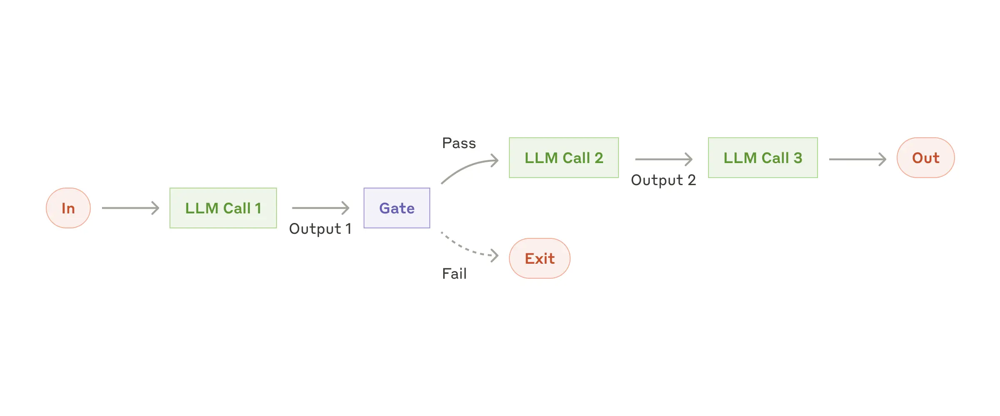

# Prompt-Chaining Workflow Template


A *github repository template* for scaffolding **prompt-chaining workflows** with Anthropic's Claude and OpenAI-compatible APIs. Built on the proven prompt-chaining pattern with LangGraph StateGraph orchestration and streaming SSE responses.

In this pattern, sequential processing steps (Analysis, Processing, Synthesis) work together to handle complex multi-step reasoning tasks. Each step is independently configured with its own Claude model, token limits, and system prompt. State flows through the workflow via LangGraph's StateGraph, enabling structured outputs and validation gates between steps.



## Key components
- **Analysis Agent:** Parses user intent, extracts key entities, assesses task complexity, and provides contextual information for subsequent steps. Returns `AnalysisOutput` with structured analysis data.
- **Processing Agent:** Generates content based on analysis results with domain-specific logic. Returns `ProcessOutput` with generated content and confidence metrics.
- **Synthesis Agent:** Polishes and formats the processed content into a final, user-ready response. Returns `SynthesisOutput` with structured formatting and styling applied.
- **LangGraph StateGraph:** Orchestrates sequential step execution with message accumulation, validation gates, and step-specific timeouts via `ChainState` TypedDict.

## Overview

This template provides a complete foundation for creating prompt-chaining workflows that:
- Execute sequential multi-step AI reasoning tasks
- Stream responses via Server-Sent Events (SSE)
- Expose OpenAI-compatible APIs
- Provide structured outputs with type safety
- Integrate with LangGraph StateGraph for complex workflows

## Features

- **Prompt-Chaining Pattern**: Sequential execution of Analysis, Processing, and Synthesis steps
- **LangGraph Integration**: StateGraph orchestration with message accumulation and validation gates
- **Streaming Responses**: Real-time SSE streaming compatible with OpenAI format
- **Structured Outputs**: Type-safe step models (AnalysisOutput, ProcessOutput, SynthesisOutput)
- **Flexible Configuration**: Per-step model selection, token limits, temperature, and timeouts
- **Observability**: Comprehensive logging, error handling, and configuration
- **Token Usage Tracking**: Automatic cost tracking with per-step token/cost logging for workflow validation and optimization. Every API call logs input/output tokens and USD costs, with aggregated metrics across all steps for complete cost visibility.
- **Request ID Propagation**: Automatic end-to-end request tracing through all steps to Anthropic API for debugging and distributed tracing
- **Request Size Validation**: Protects against memory exhaustion with configurable request body size limits (default 1MB)
- **Request Timeout Enforcement**: Prevents runaway requests from consuming resources indefinitely. Separate timeouts for analysis (15s default), processing (30s default), and synthesis (20s default) phases ensure predictable behavior. Configurable via environment variables for different deployment requirements.
- **Validation Gates**: Optional validation between steps with configurable strictness
- **Circuit Breaker**: Automatic retry with exponential backoff for Anthropic API resilience
- **Security Headers**: Standard HTTP security headers (X-Content-Type-Options, X-Frame-Options, X-XSS-Protection, Strict-Transport-Security) enabled by default to protect against common web attacks
- **Rate Limiting**: Per-user JWT + IP-based, configurable limits, standard HTTP 429 responses
- **FastAPI**: Modern async Python framework with automatic OpenAPI docs
- **Type-Safe**: Full type hints and Pydantic v2 validation
- **LangChain 1.0.0+**: For building prompt chains and managing LLM interactions
- **LangGraph 1.0.0+**: For composing multi-step agentic workflows with StateGraph orchestration

## Quick Start

### Prerequisites

- Docker and Docker Compose (recommended), OR
- Python 3.10+ for manual installation
- Anthropic API key (required)

### Quick Start with Docker (Recommended)

The fastest way to get started:

```bash
# 1. Clone and navigate to project
git clone <repo-url>
cd agentic-orchestrator-worker-template

# 2. Configure environment (see Environment Variables section)
cp .env.example .env
# Edit .env and add your ANTHROPIC_API_KEY and JWT_SECRET_KEY

# 3. Build and start the service
docker-compose up -d

# 4. Test the service
curl http://localhost:8000/health/

# 5. Generate an authentication token
export API_BEARER_TOKEN=$(docker-compose exec orchestrator-worker python scripts/generate_jwt.py)

# 6. Test the API
python console_client.py "Hello, world!"

# 7. View logs
docker-compose logs -f

# 8. Stop the service
docker-compose down
```

**What you get:**
- Isolated environment with all dependencies
- Reproducible builds across machines
- Ready-to-deploy container for production
- Automatic health monitoring

For more Docker information, see **Deployment Options** below or [CLAUDE.md](./CLAUDE.md#container-deployment-docker).

### Manual Installation

If you prefer manual installation:

```bash
# Clone or copy this template
cd agentic-orchestrator-worker-template

# Create virtual environment
python -m venv .venv
source .venv/bin/activate  # On Windows: .venv\Scripts\activate

# Install dependencies
pip install -e ".[dev]"

# Configure environment
cp .env.example .env
# Edit .env and add:
#   - ANTHROPIC_API_KEY (required)
#   - JWT_SECRET_KEY (required, generate with: python -c "import secrets; print(secrets.token_urlsafe(32))")
```

### Run Development Server

```bash
./scripts/dev.sh
# Or manually:
# fastapi dev src/workflow/main.py --host 0.0.0.0 --port 8000
```

Navigate to:
- API: http://localhost:8000
- Documentation: http://localhost:8000/docs
- Health: http://localhost:8000/health

### Test with Console Client

```bash
# Generate a bearer token first
export API_BEARER_TOKEN=$(python scripts/generate_jwt.py)

# Test the service
python console_client.py "Hello, world!"
```

## Authentication

This service uses JWT (JSON Web Token) bearer token authentication on all protected endpoints, following OpenAI API authentication standards.

### Setup

1. Generate a secure secret (minimum 32 characters):
   ```bash
   python -c "import secrets; print(secrets.token_urlsafe(32))"
   ```

2. Add to `.env`:
   ```env
   JWT_SECRET_KEY=<generated_secret>
   JWT_ALGORITHM=HS256
   ```

3. Generate bearer tokens:
   ```bash
   # Token without expiration
   python scripts/generate_jwt.py

   # Token with 7-day expiration
   python scripts/generate_jwt.py --expires-in 7d
   ```

### Usage

Include the bearer token in the `Authorization` header:

```bash
TOKEN=$(python scripts/generate_jwt.py)

# With curl
curl -H "Authorization: Bearer $TOKEN" http://localhost:8000/v1/models

# With console client
export API_BEARER_TOKEN=$TOKEN
python console_client.py "Your prompt here"
```

### Protected vs. Public Endpoints

**Protected (require bearer token):**
- `POST /v1/chat/completions`
- `GET /v1/models`

**Public (no authentication required):**
- `GET /health/`
- `GET /health/ready`

See [JWT_AUTHENTICATION.md](./JWT_AUTHENTICATION.md) for complete authentication documentation.

## Prompt-Chaining Workflow

The system implements a three-step prompt-chaining pattern that processes requests sequentially through specialized agents:

**1. Analyze** (`chain_analyze.md`)
Parses user requests to extract intent, key entities, complexity assessment, and contextual information. Output is structured JSON that feeds into the processing step.

**2. Process** (`chain_process.md`)
Generates substantive content addressing the identified intent from the analysis step. Includes confidence scoring and metadata capture for traceability.

**3. Synthesize** (`chain_synthesize.md`)
Polishes and formats the response with appropriate styling and optimization for user consumption. Produces the final user-ready output.

Each step uses a specialized system prompt and outputs structured JSON that flows to the next step. For detailed information about system prompts and architecture, see [ARCHITECTURE.md](./ARCHITECTURE.md).

## Architecture

### Prompt-Chaining Pattern

**Analysis Agent** (Intent Parser)
- Model: Configurable (default: Claude Haiku 4.5)
- Role: Parse user intent, extract key entities, assess complexity
- Output: `AnalysisOutput` with structured analysis data
- Execution: Runs with configurable timeout (default: 15s)
- System Prompt: `src/workflow/prompts/chain_analyze.md`

**Processing Agent** (Content Generator)
- Model: Configurable (default: Claude Haiku 4.5)
- Role: Generate content based on analysis results
- Output: `ProcessOutput` with generated content and confidence
- Execution: Runs with configurable timeout (default: 30s)
- System Prompt: `src/workflow/prompts/chain_process.md`

**Synthesis Agent** (Polish & Format)
- Model: Configurable (default: Claude Haiku 4.5)
- Role: Combine and format content into final response
- Output: `SynthesisOutput` with polished final text
- Execution: Runs with configurable timeout (default: 20s)
- System Prompt: `src/workflow/prompts/chain_synthesize.md`

### Performance Characteristics

- **Time Complexity**: O(N) where N = number of sequential steps (typically 3)
- **Cost Complexity**: O(N) - same token cost as sequential processing
- **Result**: Enables complex multi-step reasoning with structured outputs

### Sequential Processing with State Management

This architecture delivers multi-step reasoning benefits:

**Structured Reasoning**
- Analysis step extracts intent and context
- Processing step builds on analysis results
- Synthesis step polishes and formats output
- Each step has its own prompt engineering and configuration

**State Continuity**
- LangGraph StateGraph manages state flow through `ChainState`
- Message accumulation via `add_messages` reducer maintains conversation context
- Step outputs feed into subsequent steps as structured data
- Metadata tracking across entire workflow

**Flexibility**
- Each step can use different Claude models (all Haiku, or mix Haiku + Sonnet)
- Per-step token limits, temperature, and timeout configuration
- Optional validation gates between steps with configurable strictness
- Domain-customizable step outputs (AnalysisOutput, ProcessOutput, SynthesisOutput)

**Observability**
- Independent step execution with per-step logging
- Token usage tracking across all steps
- Cost metrics aggregated per request
- Request ID propagation for distributed tracing

**Real-World Impact**
- Complex analysis tasks that require multiple reasoning steps
- Structured outputs enable downstream processing and validation
- Cost-optimized: Fast Haiku models for all steps, upgrade to Sonnet if needed
- User experience: Streaming responses maintain perceived responsiveness

## Use Cases

This architecture excels in domains that require sequential multi-step reasoning with structured outputs:

**Research & Analysis**
- Document analysis (analyze document, extract insights, synthesize summary)
- Research synthesis (gather information, organize findings, generate report)
- Competitive intelligence (analyze competitor, assess threat, recommend strategy)
- Market analysis (evaluate market, identify trends, forecast outcomes)

**Content Generation**
- Technical documentation (analyze code, generate docs, format output)
- Blog posts (analyze topic, generate draft, polish final version)
- Marketing copy (understand audience, write copy, optimize tone)
- Email campaigns (analyze recipient, generate message, personalize content)

**Data Processing**
- Document processing (analyze document, extract entities, validate results)
- Form analysis (understand requirements, generate response, validate accuracy)
- Data validation (check quality, identify issues, recommend corrections)
- Report generation (analyze data, create summary, format output)

**Code & Development**
- Code review (understand changes, identify issues, provide feedback)
- Documentation generation (analyze code, understand purpose, generate docs)
- Test generation (understand code, design tests, generate test code)
- Refactoring guidance (analyze code, identify improvements, recommend changes)

**Decision Support**
- Multi-criteria evaluation (understand criteria, score options, rank results)
- Risk assessment (identify risks, analyze impact, prioritize mitigation)
- Scenario planning (understand scenario, model outcomes, recommend actions)
- Option comparison (analyze options, evaluate tradeoffs, recommend choice)

**Ideal Characteristics**
- Tasks **require sequential steps** (step N depends on step N-1 results)
- Output needs **structure** (type-safe results for downstream processing)
- Steps have **different concerns** (analysis vs. generation vs. synthesis)
- **Quality matters** (each step can be optimized independently)
- **Observability needed** (intermediate outputs for transparency)

**Not Ideal For**
- Parallel independent tasks (better suited for orchestrator-worker pattern)
- Single-turn chat (better suited for single-agent chat)
- Simple tasks that don't require multiple reasoning steps
- Real-time bidirectional conversations (better suited for streaming chat)

## Deployment Options

### Docker (Recommended)

**Best for:** Production deployments, consistent environments, cloud deployments

**Requires:** Docker and Docker Compose

**Quick start:**
```bash
docker-compose up -d
curl http://localhost:8000/health/
```

**Documentation:** See "Quick Start with Docker" above and [CLAUDE.md Container Deployment](./CLAUDE.md#container-deployment-docker) section for comprehensive Docker guidance including:
- Building and running containers
- Environment configuration
- Health checks and monitoring
- Troubleshooting Docker issues
- Production deployment considerations

### Manual Installation

**Best for:** Development, learning, custom environments

**Requires:** Python 3.10+, virtual environment setup

**Instructions:** See "Manual Installation" above and [CLAUDE.md Development Setup](./CLAUDE.md#development-setup) section

### Kubernetes

**Best for:** Large-scale deployments, auto-scaling, enterprise environments

**Status:** The Docker container serves as the foundation for Kubernetes deployments. Additional Kubernetes manifests (Deployments, Services, ConfigMaps, etc.) can be created based on the Docker container.

## Configuration

### Request Timeout Settings

For information on configuring request timeouts, including separate phase-specific controls for each step, see the **Request Timeout Enforcement** section in [CLAUDE.md](./CLAUDE.md).

Key environment variables (from `ChainConfig`):
- `ANALYZE_TIMEOUT` - Maximum time for analysis step (default: 15s, range: 1-270s)
- `PROCESS_TIMEOUT` - Maximum time for processing step (default: 30s, range: 1-270s)
- `SYNTHESIZE_TIMEOUT` - Maximum time for synthesis step (default: 20s, range: 1-270s)

## Customization Guide

This is a **generic template** with a simple example workflow. To adapt for your use case:

### 1. Update Chain Step Prompts

Edit `src/workflow/prompts/`:
- `chain_analyze.md` - Customize analysis step behavior (intent parsing, entity extraction)
- `chain_process.md` - Customize processing step behavior (content generation)
- `chain_synthesize.md` - Customize synthesis step behavior (formatting, polishing)

See [CLAUDE.md Customization Guide](./CLAUDE.md#customization-guide) for detailed guidance on prompt customization and JSON output requirements.

### 2. Customize Chain Models

Edit `src/workflow/models/chains.py`:
- Extend `AnalysisOutput` with domain-specific analysis fields
- Extend `ProcessOutput` with domain-specific content fields
- Extend `SynthesisOutput` with domain-specific formatting fields
- Customize `ChainConfig` with additional workflow parameters

### 3. Customize Internal Models

Edit `src/workflow/models/internal.py`:
- Add domain-specific models and validation
- Define custom data structures for your workflow

### 4. Implement Agents

Edit `src/workflow/agents/`:
- `analysis.py` - Customize intent parsing and entity extraction for your domain
- `processing.py` - Implement domain-specific content generation
- `synthesis.py` - Customize formatting and polishing logic

### 5. Update Configuration

Edit `.env` and `src/workflow/config.py`:
- Per-step model IDs (upgrade to Sonnet if needed for complex reasoning)
- Per-step token limits and temperature
- Timeout configuration per phase
- Enable/disable validation gates between steps

## Project Structure

```
agentic-service-template/
├── src/workflow/
│   ├── agents/           # Orchestrator and Worker agents
│   ├── api/             # FastAPI endpoints
│   ├── models/          # Data models (OpenAI + internal)
│   ├── prompts/         # System prompts
│   ├── utils/           # Errors, logging, utilities
│   ├── config.py        # Configuration management
│   └── main.py          # FastAPI application
├── tests/               # Test suite
├── scripts/             # Development scripts
├── console_client.py    # Testing client
└── pyproject.toml       # Dependencies and config
```

## Development

### Run Tests

```bash
./scripts/test.sh
```

### Format Code

```bash
./scripts/format.sh
```

### View Coverage

```bash
open htmlcov/index.html
```

## API Reference

### POST /v1/chat/completions

OpenAI-compatible streaming chat completion endpoint.

**Request:**
```json
{
  "model": "template-service-v1",
  "messages": [
    {"role": "user", "content": "Your prompt here"}
  ],
  "max_tokens": 1000
}
```

**Response:** Server-Sent Events (SSE) stream

### GET /v1/models

List available models.

### GET /health

Health check endpoint.

## Docker Quick Reference

Common Docker commands for this project:

```bash
# Build image (usually automatic with docker-compose)
docker build -t orchestrator-worker:latest .

# Start service (foreground - see logs in real-time)
docker-compose up

# Start service (background)
docker-compose up -d

# View logs
docker-compose logs -f

# View logs for specific service
docker-compose logs -f orchestrator-worker

# Stop service
docker-compose down

# Stop and remove all data
docker-compose down -v

# Execute command in running container
docker-compose exec orchestrator-worker bash

# Rebuild image and restart
docker-compose up -d --build

# Check container status
docker-compose ps

# See resource usage
docker stats orchestrator-worker-api

# Clean rebuild (skip cache)
docker-compose build --no-cache orchestrator-worker
```

For more details, see [CLAUDE.md Container Deployment](./CLAUDE.md#container-deployment-docker) section.

## Environment Variables

See `.env.example` for all available configuration options.

Critical variables:

**API & Authentication:**
- `ANTHROPIC_API_KEY` - **Required** for Claude API access
- `JWT_SECRET_KEY` - **Required** for authentication (minimum 32 characters)
- `JWT_ALGORITHM` - JWT algorithm (default: HS256)

**Models:**
- `ORCHESTRATOR_MODEL` - Model for orchestrator (default: claude-sonnet-4-5-20250929)
- `WORKER_MODEL` - Model for workers (default: claude-haiku-4-5-20251001)
- `SYNTHESIZER_MODEL` - Model for synthesizer (default: claude-haiku-4-5-20251001)

**Server:**
- `LOG_LEVEL` - Logging verbosity (DEBUG, INFO, WARNING, ERROR, CRITICAL) - default: INFO
- `LOG_FORMAT` - Log format (json, standard) - default: json
- `API_HOST` - Server host (default: 0.0.0.0)
- `API_PORT` - Server port (default: 8000)

### Logging

Structured JSON logging with five levels (CRITICAL, ERROR, WARNING, INFO, DEBUG). Default is INFO for production. Use DEBUG for development/troubleshooting.

See [CLAUDE.md Logging & Observability](./CLAUDE.md#logging--observability) for:
- Log level descriptions and when each is used
- JSON log structure and fields
- Docker log viewing commands
- Performance and cost tracking
- Common troubleshooting patterns
