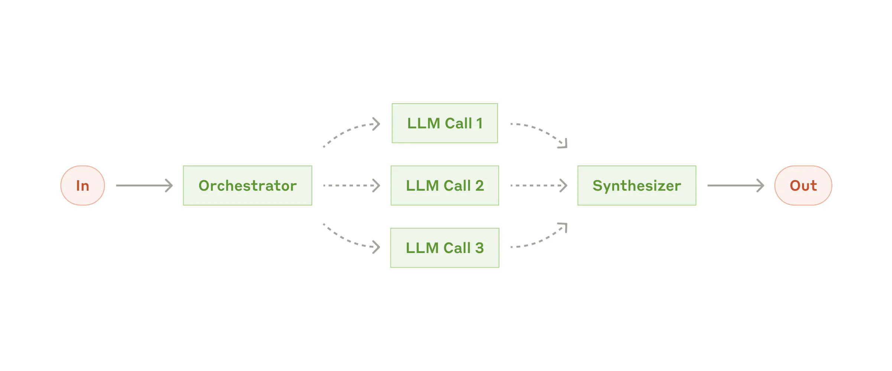

# Agentic Orchestrator-Worker Pattern Template


A *github repository template* for scaffolding **agentic orchestrator-worker** services with Anthropic's Claude Code and OpenAI-compatible APIs. Built on the *proven* orchestrator-worker pattern with streaming SSE responses.

In this pattern, a central orchestrator agent (ex. `claude-sonnet-4-5`) assigns tasks to worker agents (ex. `claude-haiku-4-5`) and manages their execution. The synthesizer agent (ex. `claude-haiku-4-5`) receives the results, aggregates, and returns a final response to the orchestrator agent. This pattern, similar to the Master-Worker Pattern in distributed computing, ensures efficient task delegation and centralized coordination while allowing workers to focus on specific, independent tasks. 



## Key components
- **Orchestrator:** This central agent analyzes a user's request, decomposes it into a dynamic set of subtasks, and assigns them to the appropriate workers. It manages the overall workflow.
- **Workers:** These are specialized agents that perform specific, focused subtasks. They are designed to be experts in a particular area and return high-quality results for their assigned jobs.
- **Synthesizer:** This component receives the results from the various workers and aggregates them into a single, unified, and polished final response that addresses the original query.

## Overview

This template provides a complete foundation for creating agentic services that:
- Coordinate multiple AI agents in parallel
- Stream responses via Server-Sent Events (SSE)
- Expose OpenAI-compatible APIs
- Scale efficiently with asyncio

## Features

- **Multi-Agent Orchestration**: Orchestrator coordinates multiple worker agents in parallel
- **Streaming Responses**: Real-time SSE streaming compatible with OpenAI format
- **Cost-Optimized**: Smart orchestrator (expensive model) + cheap workers = optimal economics
- **True Parallelism**: Workers execute simultaneously via `asyncio.gather()`
- **Observability**: Comprehensive logging, error handling, and configuration
- **Token Usage Tracking**: Automatic cost tracking with per-agent token/cost logging for workflow validation and optimization. Every API call logs input/output tokens and USD costs, with aggregated metrics across workers and synthesizer for complete cost visibility.
- **Request ID Propagation**: Automatic end-to-end request tracing through all agents to Anthropic API for debugging and distributed tracing
- **Request Size Validation**: Protects against memory exhaustion with configurable request body size limits (default 1MB)
- **Request Timeout Enforcement**: Prevents runaway requests from consuming resources indefinitely. Separate timeouts for worker coordination (45s default) and synthesis (30s default) phases ensure predictable behavior. Configurable via environment variables for different deployment requirements.
- **Circuit Breaker**: Automatic retry with exponential backoff for Anthropic API resilience
- **Security Headers**: Standard HTTP security headers (X-Content-Type-Options, X-Frame-Options, X-XSS-Protection, Strict-Transport-Security) enabled by default to protect against common web attacks
- **Rate Limiting**: Per-user JWT + IP-based, configurable limits, standard HTTP 429 responses
- **FastAPI**: Modern async Python framework with automatic OpenAPI docs
- **Type-Safe**: Full type hints and Pydantic validation
- **LangChain Integration**: LangChain 1.0.0+ for building prompt chains and managing LLM interactions
- **LangGraph Support**: LangGraph 1.0.0+ for composing multi-step agentic workflows and complex prompt-chaining patterns

## Quick Start

### Prerequisites

- Docker and Docker Compose (recommended), OR
- Python 3.10+ for manual installation
- Anthropic API key (required)

### Quick Start with Docker (Recommended)

The fastest way to get started:

```bash
# 1. Clone and navigate to project
git clone <repo-url>
cd agentic-orchestrator-worker-template

# 2. Configure environment (see Environment Variables section)
cp .env.example .env
# Edit .env and add your ANTHROPIC_API_KEY and JWT_SECRET_KEY

# 3. Build and start the service
docker-compose up -d

# 4. Test the service
curl http://localhost:8000/health/

# 5. Generate an authentication token
export API_BEARER_TOKEN=$(docker-compose exec orchestrator-worker python scripts/generate_jwt.py)

# 6. Test the API
python console_client.py "Hello, world!"

# 7. View logs
docker-compose logs -f

# 8. Stop the service
docker-compose down
```

**What you get:**
- Isolated environment with all dependencies
- Reproducible builds across machines
- Ready-to-deploy container for production
- Automatic health monitoring

For more Docker information, see **Deployment Options** below or [CLAUDE.md](./CLAUDE.md#container-deployment-docker).

### Manual Installation

If you prefer manual installation:

```bash
# Clone or copy this template
cd agentic-orchestrator-worker-template

# Create virtual environment
python -m venv .venv
source .venv/bin/activate  # On Windows: .venv\Scripts\activate

# Install dependencies
pip install -e ".[dev]"

# Configure environment
cp .env.example .env
# Edit .env and add:
#   - ANTHROPIC_API_KEY (required)
#   - JWT_SECRET_KEY (required, generate with: python -c "import secrets; print(secrets.token_urlsafe(32))")
```

### Run Development Server

```bash
./scripts/dev.sh
# Or manually:
# fastapi dev src/orchestrator_worker/main.py --host 0.0.0.0 --port 8000
```

Navigate to:
- API: http://localhost:8000
- Documentation: http://localhost:8000/docs
- Health: http://localhost:8000/health

### Test with Console Client

```bash
# Generate a bearer token first
export API_BEARER_TOKEN=$(python scripts/generate_jwt.py)

# Test the service
python console_client.py "Hello, world!"
```

## Authentication

This service uses JWT (JSON Web Token) bearer token authentication on all protected endpoints, following OpenAI API authentication standards.

### Setup

1. Generate a secure secret (minimum 32 characters):
   ```bash
   python -c "import secrets; print(secrets.token_urlsafe(32))"
   ```

2. Add to `.env`:
   ```env
   JWT_SECRET_KEY=<generated_secret>
   JWT_ALGORITHM=HS256
   ```

3. Generate bearer tokens:
   ```bash
   # Token without expiration
   python scripts/generate_jwt.py

   # Token with 7-day expiration
   python scripts/generate_jwt.py --expires-in 7d
   ```

### Usage

Include the bearer token in the `Authorization` header:

```bash
TOKEN=$(python scripts/generate_jwt.py)

# With curl
curl -H "Authorization: Bearer $TOKEN" http://localhost:8000/v1/models

# With console client
export API_BEARER_TOKEN=$TOKEN
python console_client.py "Your prompt here"
```

### Protected vs. Public Endpoints

**Protected (require bearer token):**
- `POST /v1/chat/completions`
- `GET /v1/models`

**Public (no authentication required):**
- `GET /health/`
- `GET /health/ready`

See [JWT_AUTHENTICATION.md](./JWT_AUTHENTICATION.md) for complete authentication documentation.

## Architecture

### Orchestrator-Worker Pattern

**Orchestrator** (Smart Coordinator)
- Model: Claude Sonnet 4.5 (expensive, intelligent)
- Role: Parse intent, decompose tasks, coordinate workers, aggregate results
- Parallelism: Spawns N workers and runs them via `asyncio.gather()`

**Worker** (Fast Executor)
- Model: Claude Haiku 4.5 (cheap, fast)
- Role: Execute specific tasks assigned by orchestrator
- Isolation: Each worker has its own API connection and context

**Synthesizer** (Fast Aggregator & Presenter)
- Model: Claude Haiku 4.5 (cheap, fast)
- Role: Aggregates worker results, synthesizes into cohesive response
- Responsibilities: Owns all aggregation logic, formatting, and final polishing

### Performance Characteristics

- **Time Complexity**: O(1) - constant time regardless of number of tasks
- **Cost Complexity**: O(N) - same token cost as sequential
- **Result**: 10-20x speedup at no additional cost

### The Force Multiplier Effect

This architecture delivers dramatic improvements across three dimensions:

**Speed: 5-20x Faster**
- **Sequential approach**: 5 tasks × 3 seconds = 15 seconds total
- **Parallel approach**: max(5 tasks) = ~3 seconds total
- Workers execute simultaneously via `asyncio.gather()`, so total time equals the longest single task, not the sum of all tasks

**Scale: Handle More Without Bottlenecks**
- Orchestrator spawns N workers dynamically based on task complexity
- Each worker operates independently with its own API connection
- No shared state or contention between workers
- Scales horizontally: 10 workers cost the same time as 100 workers

**Cost: Same Economics, Better Results**
- **Token cost remains O(N)**: You pay for what you process
- **Smart model allocation**: Expensive Sonnet for orchestration (once), cheap Haiku for execution (N times)
- **Cost example**: 5 tasks × 1000 tokens = 5000 tokens whether sequential or parallel
- **Value multiplier**: Get 10-20x faster results for the same API cost

**Why This Works**
- API calls are I/O-bound, not CPU-bound
- While Worker 1 waits for API response, Workers 2-N are also waiting in parallel
- Python's async/await allows thousands of concurrent connections
- Anthropic's API handles concurrent requests efficiently

**Real-World Impact**
- Research report that took 2 minutes now takes 15 seconds
- Data processing job that cost $5 still costs $5, but finishes before your coffee gets cold
- User experience transforms from "loading..." to "instant"

## Use Cases

This architecture excels in domains where tasks can be decomposed into independent, parallelizable units:

**Research & Analysis**
- Multi-source research (analyze 10 papers simultaneously)
- Competitive intelligence (research 5 competitors in parallel)
- Market analysis (evaluate multiple segments concurrently)
- Literature reviews (process multiple documents at once)

**Content Generation**
- Multi-perspective content (generate 5 viewpoints on a topic)
- A/B testing variations (create multiple copy variations simultaneously)
- Translation workflows (translate into 10 languages in parallel)
- Social media campaigns (generate platform-specific content at once)

**Data Processing**
- Batch document analysis (process 100 contracts simultaneously)
- Log file analysis (analyze multiple log files in parallel)
- Data enrichment (enrich multiple records concurrently)
- Quality assurance (validate multiple data sources at once)

**Code & Development**
- Multi-file code review (review 10 files simultaneously)
- Test generation (generate tests for multiple modules in parallel)
- Documentation generation (document multiple APIs concurrently)
- Dependency analysis (analyze multiple packages at once)

**Decision Support**
- Multi-criteria evaluation (score options across different criteria in parallel)
- Risk assessment (evaluate risks from multiple angles simultaneously)
- Scenario planning (model multiple scenarios concurrently)
- Option comparison (compare alternatives across dimensions in parallel)

**Ideal Characteristics**
- Tasks are **independent** (can execute without coordination)
- Tasks are **I/O-bound** (waiting for API responses, not CPU)
- Tasks are **parallelizable** (no sequential dependencies)
- **Speed matters** (user experience or time-to-insight is critical)
- **Scale varies** (number of tasks changes per request)

**Not Ideal For**
- Sequential workflows where task N depends on task N-1's results
- Single, complex tasks that can't be decomposed
- CPU-bound operations (better suited for multiprocessing)
- Real-time bidirectional conversations (better suited for single-agent chat)

## Deployment Options

### Docker (Recommended)

**Best for:** Production deployments, consistent environments, cloud deployments

**Requires:** Docker and Docker Compose

**Quick start:**
```bash
docker-compose up -d
curl http://localhost:8000/health/
```

**Documentation:** See "Quick Start with Docker" above and [CLAUDE.md Container Deployment](./CLAUDE.md#container-deployment-docker) section for comprehensive Docker guidance including:
- Building and running containers
- Environment configuration
- Health checks and monitoring
- Troubleshooting Docker issues
- Production deployment considerations

### Manual Installation

**Best for:** Development, learning, custom environments

**Requires:** Python 3.10+, virtual environment setup

**Instructions:** See "Manual Installation" above and [CLAUDE.md Development Setup](./CLAUDE.md#development-setup) section

### Kubernetes

**Best for:** Large-scale deployments, auto-scaling, enterprise environments

**Status:** The Docker container serves as the foundation for Kubernetes deployments. Additional Kubernetes manifests (Deployments, Services, ConfigMaps, etc.) can be created based on the Docker container.

## Configuration

### Request Timeout Settings

For information on configuring request timeouts, including separate phase-specific controls for worker coordination and synthesis phases, see the **Request Timeout Enforcement** section in [CLAUDE.md](./CLAUDE.md).

Key environment variables:
- `WORKER_COORDINATION_TIMEOUT` - Maximum time for parallel worker execution (default: 45s)
- `SYNTHESIS_TIMEOUT` - Maximum time for response synthesis (default: 30s)

## Customization Guide

This is a **generic template** with a simple echo example. To adapt for your use case:

### 1. Update System Prompts

Edit `src/orchestrator_worker/prompts/`:
- `orchestrator_system.md` - Define orchestrator behavior
- `worker_system.md` - Define worker behavior
- `synthesizer_system.md` - Define synthesizer behavior

### 2. Customize Models

Edit `src/orchestrator_worker/models/internal.py`:
- Replace `TaskRequest` and `TaskResult` with your domain models
- Add domain-specific validation and business logic

### 3. Implement Agents

Edit `src/orchestrator_worker/agents/`:
- `orchestrator.py` - Customize `_determine_task_count()` and coordination logic
- `worker.py` - Customize `process_task()` for your use case
- `synthesizer.py` - Customize `process_task()` for your use case

### 4. Update Configuration

Edit `.env` and `src/orchestrator_worker/config.py`:
- Model IDs, token limits, temperatures
- API settings, logging, streaming config

## Project Structure

```
agentic-service-template/
├── src/orchestrator_worker/
│   ├── agents/           # Orchestrator and Worker agents
│   ├── api/             # FastAPI endpoints
│   ├── models/          # Data models (OpenAI + internal)
│   ├── prompts/         # System prompts
│   ├── utils/           # Errors, logging, utilities
│   ├── config.py        # Configuration management
│   └── main.py          # FastAPI application
├── tests/               # Test suite
├── scripts/             # Development scripts
├── console_client.py    # Testing client
└── pyproject.toml       # Dependencies and config
```

## Development

### Run Tests

```bash
./scripts/test.sh
```

### Format Code

```bash
./scripts/format.sh
```

### View Coverage

```bash
open htmlcov/index.html
```

## API Reference

### POST /v1/chat/completions

OpenAI-compatible streaming chat completion endpoint.

**Request:**
```json
{
  "model": "template-service-v1",
  "messages": [
    {"role": "user", "content": "Your prompt here"}
  ],
  "max_tokens": 1000
}
```

**Response:** Server-Sent Events (SSE) stream

### GET /v1/models

List available models.

### GET /health

Health check endpoint.

## Docker Quick Reference

Common Docker commands for this project:

```bash
# Build image (usually automatic with docker-compose)
docker build -t orchestrator-worker:latest .

# Start service (foreground - see logs in real-time)
docker-compose up

# Start service (background)
docker-compose up -d

# View logs
docker-compose logs -f

# View logs for specific service
docker-compose logs -f orchestrator-worker

# Stop service
docker-compose down

# Stop and remove all data
docker-compose down -v

# Execute command in running container
docker-compose exec orchestrator-worker bash

# Rebuild image and restart
docker-compose up -d --build

# Check container status
docker-compose ps

# See resource usage
docker stats orchestrator-worker-api

# Clean rebuild (skip cache)
docker-compose build --no-cache orchestrator-worker
```

For more details, see [CLAUDE.md Container Deployment](./CLAUDE.md#container-deployment-docker) section.

## Environment Variables

See `.env.example` for all available configuration options.

Critical variables:

**API & Authentication:**
- `ANTHROPIC_API_KEY` - **Required** for Claude API access
- `JWT_SECRET_KEY` - **Required** for authentication (minimum 32 characters)
- `JWT_ALGORITHM` - JWT algorithm (default: HS256)

**Models:**
- `ORCHESTRATOR_MODEL` - Model for orchestrator (default: claude-sonnet-4-5-20250929)
- `WORKER_MODEL` - Model for workers (default: claude-haiku-4-5-20251001)
- `SYNTHESIZER_MODEL` - Model for synthesizer (default: claude-haiku-4-5-20251001)

**Server:**
- `LOG_LEVEL` - Logging verbosity (DEBUG, INFO, WARNING, ERROR, CRITICAL) - default: INFO
- `LOG_FORMAT` - Log format (json, standard) - default: json
- `API_HOST` - Server host (default: 0.0.0.0)
- `API_PORT` - Server port (default: 8000)

### Logging

Structured JSON logging with five levels (CRITICAL, ERROR, WARNING, INFO, DEBUG). Default is INFO for production. Use DEBUG for development/troubleshooting.

See [CLAUDE.md Logging & Observability](./CLAUDE.md#logging--observability) for:
- Log level descriptions and when each is used
- JSON log structure and fields
- Docker log viewing commands
- Performance and cost tracking
- Common troubleshooting patterns
